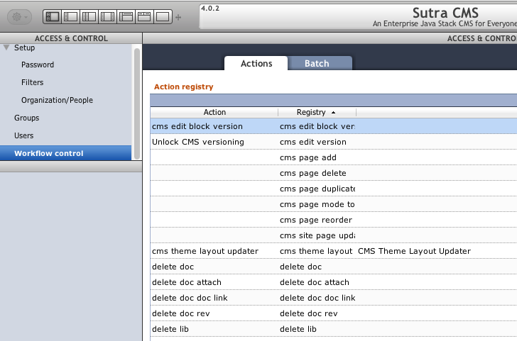
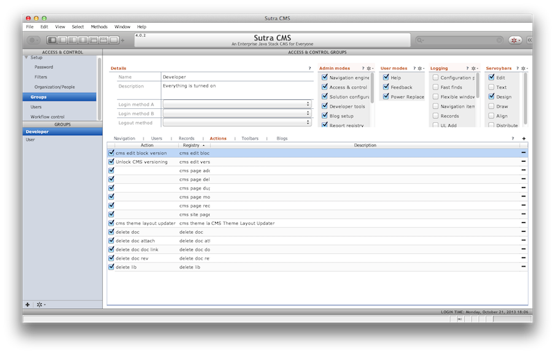

# Security


Sutra CMS is not a stand alone application in and of itself. It is more
accurately described as a set of modules that add CMS functionality to
larger applications.

As such, the architecture of security is meant to hook into another
module that handles that sort of thing. When run on the [Data Sutra](http://www.data-sutra.com) application platform, Data Sutra’s Access and Control application controls security for Sutra CMS.

<!-- toc -->

## Overview

End result is one place to control security for large applications in
one place. This includes SaaS deployments, login and organization
management, password management, and group security model that operates
on three levels:

1.  What screens a group can access
2.  What records a group can see
3.  What workflow actions a group can trigger

The first two items are handled without any input from Sutra CMS.


## Workflow control

### 1. Publish actions

The third item—workflow actions—works by “publishing” various CMS
actions in the CMS module initialization method
(`scopes.CMS.init.items()`):

```js
/**
    * Registry actions for app
    * 
    * @return {Object[]}
    */
this.items =  new function() {
    return [
        {name: 'Block version editable', registry: 'cms edit block version', description: 'Allow scrapbook versions to be re-opened for editing', uuid: '0016790E-70BB-4B13-B6FE-39E641E98121'},
        {name: 'Page version editable', registry: 'cms edit version', description: 'Allow versions to be re-opened for editing', uuid: '0016790E-70BB-4B13-B6FE-39E641E98122'},
        {name: 'Add a new page', registry: 'cms page add', description: 'Allow a new page to be created', uuid: '0016790E-70BB-4B13-B6FE-39E641E98123'},
        {name: 'Delete selected page', registry: 'cms page delete', description: 'Allow the selected page to be deleted', uuid: '0016790E-70BB-4B13-B6FE-39E641E98124'},
        {name: 'Create duplicate of selected page', registry: 'cms page duplicate', description: 'Allow duplication of selected page', uuid: '0016790E-70BB-4B13-B6FE-39E641E98125'},
        {name: 'Page setup: Real mode v. GUI', registry: 'cms page mode toggle', description: 'Allow viewing the selected page as it will appear on the web', uuid: '0016790E-70BB-4B13-B6FE-39E641E98126'},
        {name: 'Reorder pages within a site', registry: 'cms page reorder', description: 'Allow the positionment of pages within a site to be changed', uuid: '0016790E-70BB-4B13-B6FE-39E641E98127'},
        {name: 'Only show full-screen page', registry: 'cms page sitemap', description: 'Show sitemap only when needed', uuid: '0016790E-70BB-4B13-B6FE-39E641E98128'},
        {name: 'Update all pages', registry: 'cms site page update', description: 'Add missing areas to all pages in a site. Useful for when a major template change occurs.', uuid: '0016790E-70BB-4B13-B6FE-39E641E98129'},
        {name: 'Refresh all theme pages', registry: 'cms theme layout page update', description: 'Update all pages using a theme', uuid: '0016790E-70BB-4B13-B6FE-39E641E9812A'}
    ]
}
```

### 2. Registry

The Data Sura Access and Control application picks up all modules that
publish actions and creates workflow registry items:



### 3. Group actions

Once in the registry, workflow actions can be assigned to groups:



### 4. Action validation

Finally, Data Sutra exposes an API method for validating a particular
workflow action against the currently logged in user. `True/false` is
returned:

```js
globals.TRIGGER_registered_action_authenticate('cms page delete')
```

## Summary

While the workflow actions list isn’t massive or particularly granular,
Sutra CMS has many places where it checks to see if a user has
permission to do something.

The combination of workflow actions and the capabilities of Data Sutra’s
Access and Control application makes it extremely flexible to define
security on the fly for users. Without having different logins for
various parts of an entire application.

Additionally, when [extending Sutra CMS](developer/extending-cms.html) with your own modules and
applications—this system makes it very easy for you to define, code and
configure your own security rules.