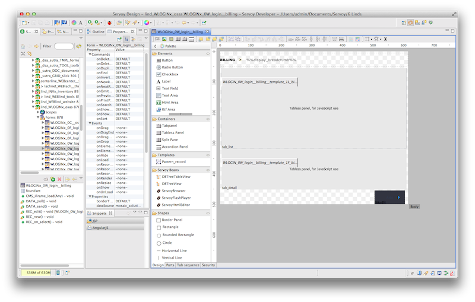
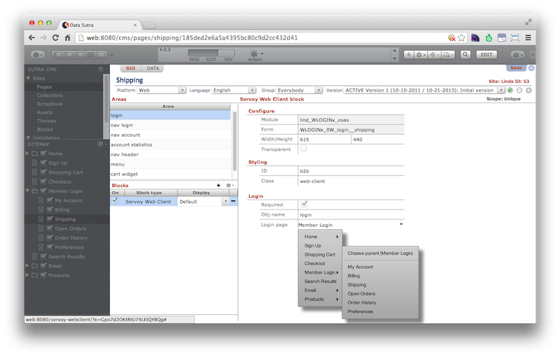
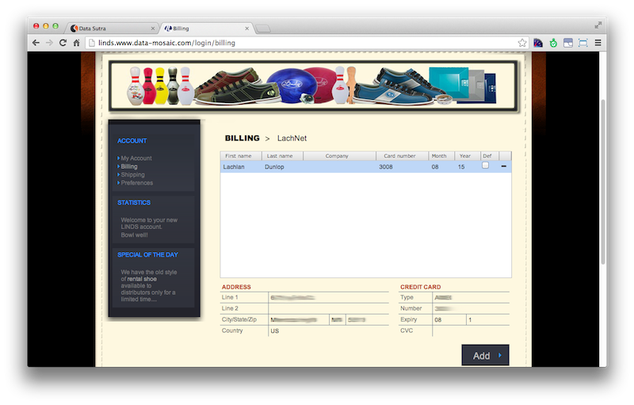

## Servoy Web Client Block

Sutra CMS comes with a special block worth its own mention: the **Servoy
Web Client (SWC)** block.

This block allows you to easily assign any SWC form to a page by simply
selecting your SWC module and form from selector fields (we go grab all
the available modules and forms for you). So if you don’t like the
complexities of client-side web programming and want to speed things up,
code your business logic with Servoy Web Client and then just include
anywhere on your site.

The use of the SWC block allows you to implement hybrid
website/applications where the navigation is supplied by the CMS and the
functionality by SWC. Benefits include:

1.  Not having to build the navigation layer in SWC
2.  Real URL’s for linking and SEO
3.  Pages with real flow instead of fixed css
4.  Apps that look like your website
5.  Ability to mix in other block types on the same page as your app

The SWC block leverages the best of both single page rich internet
applications (RIA’s) and CMS’s in the same platform. This gives you a
lot of flexibility in delivering solutions that get done fast, look good
and play well in the enterprise environment.

