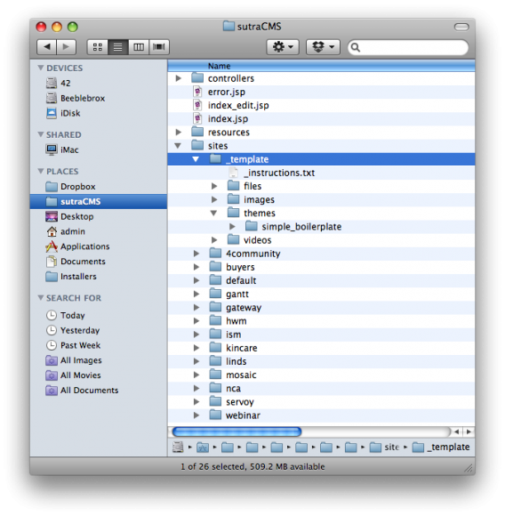
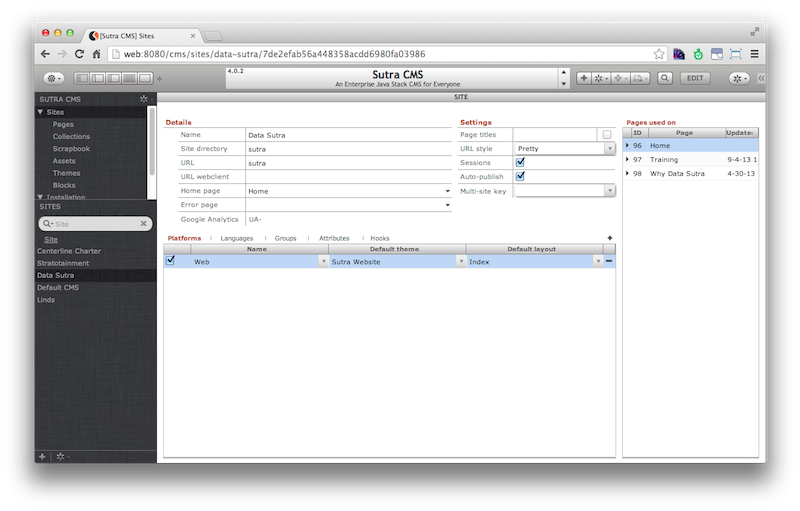

# Setup

<!-- toc -->

The Sutra CMS installation includes a sample site and everything needed
to run it—site meta data, a theme, some basic blocks, and a few pages.

The sample site can be modified to suit your purposes or you can create
many sites as Sutra CMS is multi-site capable from one installation.

Every site requires at minimum a dedicated site directory and site
record.

Additionally, it is highly recommended that you create separate Servoy
modules to place custom code in so as to not pollute the core Sutra CMS
modules. Ideally, each website should have a dedicated module for custom
block code. It is also common to create modules for specific functions
and workflows that can be used across all of your websites.

## Site directory

Site directories are located in `/sutraCMS/site/` directory. The
`_template` directory is boilerplate that you can use as a starting
point for creating a new site directory. It contains all the directory
structures that Sutra CMS expects.

To use, duplicate and rename. A naming convention that is similar to the
website name is recommended. You will enter this name in the site record
described in the next section.

The files, images and videos folders store uploaded assets of those
types. The themes directory contains all the themes your site has access
to. Each theme has it’s own folder.

## Site record

Site records at minimum needs the `Name` and `Site directory` data
points filled in. If the URL field is left blank the value of localhost
will be assumed.

*The Site directory data point should have the name of the site
directory described in the previous section as its value.*

## Site module

While you can create entire sites without any custom server-side coding,
it is common to extend the functionality of Sutra CMS by customizing
code for a particular website or installation, interact with external
business workflows, grab data via REST services, and even integrate with
entire applications.

See [Extending Sutra CMS](developer/extending-cms.md) for details.
