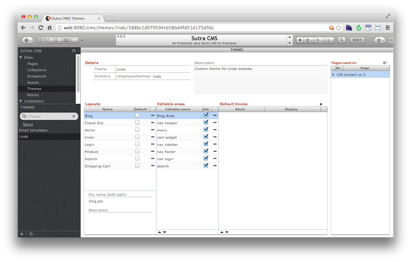

# Themes

<!-- toc -->

A theme is a collection of static html files (layouts) that have been
adapted to allow Sutra CMS to fill with dynamic content. Each page of a
website requires a theme layout to provide the “view” of the page.

Theme layouts start off as static html files. These files can be custom
built by designers for your website or chosen from among the many
available themes on the web. A complete theme typically includes several
html files for various layout options and all of the resources—images,
css and javascript—that go into making the theme layouts look and behave
as intended.

The process of adapting a theme for Sutra CMS is quite simple. Because
it requires few modifications to the original static html files, the
design process can easily be iterated on while a site is in development
(and even in production).

The theme abstraction allows designers to do what they do best—without
impeding the efforts of programmers and content experts.

## Setup

Drop the folder containing your theme into the themes directory of your
site. It is probably best that the name of your theme folder doesn’t
contain any spaces or weird characters.

Create a text file (not an rtf file!) in your theme folder with the name
of description.txt. Put the name of the theme in the first line and the
theme description in the following lines. Sutra CMS will not recognize
your theme without this file as it contains the theme meta data that
Sutra CMS needs when registering your theme.

## Cutting a theme layout

We typically use the phrase “cutting a theme” to denote converting
static html into files that Sutra CMS can use.

Apply the following steps for each static html file you want to convert.

###### 1. Start by testing your static html by opening in a browser as a file:

    file:///Applications/Servoy/application_server/server/webapps/ROOT/sutraCMS/sites/site_directory/themes/theme_directory/index.html

And then with Servoy running, test again as an http request:

    http://localhost:8080/sutraCMS/sites/site_directory/themes/theme_directory/index.html

###### 2. Change the extension from html to jsp and test again:

    http://localhost:8080/sutraCMS/sites/site_directory/themes/theme_directory/index.jsp

###### 3. Add the following code snippet to very top of the page before
anything else:

    <%@ page import = "java.util.*" %>
    <% HashMap pageData = (HashMap)request.getAttribute("pageData");%>

###### 4. Insert following resource prefix for all resource calls (src, href, hrf, @import url, etc):

    <%=(String)request.getAttribute("themeDirectory")%>

For example, this code:

    <link rel="stylesheet" type="text/css" href="css/style.css" />
    
    

becomes:

    <link rel="stylesheet" type="text/css" href="<%=(String)request.getAttribute("themeDirectory")%>/css/style.css" />
    
    /images/contactme.png" alt="" class="contactme" />

## Including theme snippets

Theme snippets allows you to reuse theme code in more than one theme
layout file. Headers, footers, navigations, etc — are useful sections to
be coded as theme snippets.

Theme snippets are files that are located in the elements directory in
your theme directory. By convention, these files are given the extension
of `.jspf`.

The following code will include the named snippet file into a theme
layout file:

    <%@ include file="elements/footer.jspf" %>

## Registering a theme

Registering a theme is done on the “Themes” page of Sutra CMS. The “+”
button at the bottom of the themes list gives you a list of all the
available themes in your sites theme directory.

If your theme isn’t listed, make sure that you created the
`description.txt` file correctly and the `Directory` data point is
pointing to the right folder.

The action of registering a theme creates meta data representing your
various theme layouts and editable areas on those layouts. You can
assign default blocks to editable areas which will be pulled in
automatically when new pages are created.

## Testing your theme

Once your theme is registered, create a page for each of your theme
layouts!

## Iterating with designers

Sutra CMS comes with a number of actions that greatly simplify iterating
with designers on your theme.

1. If you change anything in your theme—create a new theme layout file,
add an editable area, etc—“refresh” the theme with the action on the
action wheel at the bottom of the theme list.

Your default block settings will not be overwritten by this action
unless of course an editable area or theme layout has been deleted
entirely.

2. Under the action wheel of the pages sitemap there is a “refresh”
action for pages to update any pages that use an older version of a
theme layout. You can choose to reset page data to the theme layout
defaults or keep current page data. The latter option will keep page
data for editable areas that have the same name.

3. You can also trigger this page refresh for all pages a theme is used
on via the “refresh all pages” action. This action is found under the
themes page &gt; pages used on &gt; action wheel.

## Adding logic

Even though theme layouts are jsp files, it is not recommended that you
add logic directly in your theme layouts. Disadvantages:

1.  managing code requires a separate system than Servoy
2.  iterating with designers is more difficult
3.  need to figure out how to debug

Instead, keep your theme layouts as “dumb” as possible and do all your
logic server-side in Servoy.

The standard way for this is to add blocks to editables areas. But what
if you want the same logic for every page using a theme layout? Easy
approach is to add a scrapbook block as a default to a theme editable
area. Every time a page is created with that theme layout, that block is
brought in automatically.

A less meta data driven approach would be to code an AJAX call (see AJAX
documentation) into your theme layout file that fills in a section of
your template with markup returned from the server when a page loads.
This is a useful approach when creating themes to distribute and you
want the least amount of configuration hassles.

Finally—having said all this—there are probably use cases where coding
at the jsp level could be the easiest way to go. Integrating legacy jsp
applications, servlets and beans comes to mind.