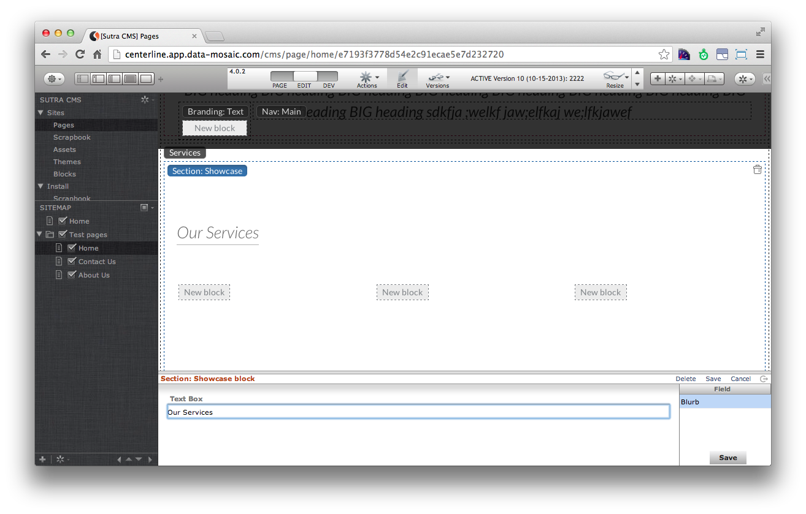

# Block Builder

For an overview of blocks: [Blocks](site/blocks.html)

<!-- toc -->

Depending on your site design and content creation guidelines, some
content could use an additional layer of structure than that afforded to
you by the basic set of content blocks.

Of course you can code blocks with the specific structure you need but
this requires a programmer and an update to the server.

The block builder is a tool that allows designers and content creators
to build structures of content without needing access to the coding
layer. This is done by assembling and ordering a collection of
“builders”, each of which has pre and post hooks to wrap each input type
in html. Each builder type can also be specified as required and if it
is allowed to repeat.

The process is similar to what programmers called “templating”. Except
with a user interface that implements a step-by-step process.


## Builder types

The following builder types are available: STATIC HTML, TEXTBOX,
TEXTAREA, IMAGE, FILE DOWNLOAD, PAGE LINK, URL, DATE, WYSIWYG, and
TABLE.

The STATIC HTML builder type is special in that it is used only for
configuring your block with html that is outputted in the order that it
is encountered in the field list when a page is requested. All the other
field types have a data entry component when the block is added to a
page.

With the combination of data entry types, pre and post html wrappers,
and the static html type—you can create complex content structures that
output to the exact specifications of your website. Without having to
train your content creators in advanced TinyMCE editing or getting a
programmer to code a block for you.

Once you are done configuring your block builder, hit the “Publish”
button to register the block.


## Using

Most blocks have specific editors that open up in a split pane when the
block is added to a page (or existing one clicked on to edit). These
editors give the user various functionality to enter and configure data.

The block builder editor displays a list of the configured builders.
Selecting an item in this list opens up the specific editor for that
builder type.




## Special block tag

Blocks can even be used as an input to other blocks. This is especially
useful in breaking down content into rows and columns. When editing a
page, a block of this type will show a target area for you to create
blocks in.

This is accomplished with a special tag that is returned in the markup
of a block: `{{code}}`. For block builders, use the STATIC HTML builder
type to insert this tag.


## Example

Let’s create a block builder of the following code. This is the markup
of one row in a bootstrap 3 based theme:

```html
    <div id="showcase">
        <div class="container">
            <div class="section_header">
                <h3>Our Services</h3>
            </div>      

            <div class="row feature_wrapper">
                <!-- Features Row -->
                <div class="features_op1_row">
                    <!-- Feature -->
                    <div class="col-sm-4 feature first">
                        {{BLOCK}}
                    </div>
                    <!-- Feature -->
                    <div class="col-sm-4 feature">
                        {{BLOCK}}
                    </div>
                    <!-- Feature -->
                    <div class="col-sm-4 feature last">
                        {{BLOCK}}
                    </div>
                </div>
            </div>
        </div>
    </div>
```

**Builder 1: STATIC HTML**

```html
    <div id="showcase">
        <div class="container">
            <div class="section_header">
```

**Builder 2: TEXTBOX**

- wrapper pre: `<h3>`  
- wrapper post: `</h3>`

**Builder 3: STATIC HTML**

```html
    </div>      

        <div class="row feature_wrapper">
            <!-- Features Row -->
            <div class="features_op1_row">
                <!-- Feature -->
                <div class="col-sm-4 feature first">
					{{BLOCK}}
                </div>
                <!-- Feature -->
                <div class="col-sm-4 feature">
					{{BLOCK}}
                </div>
                <!-- Feature -->
                <div class="col-sm-4 feature last">
					{{BLOCK}}
                </div>
            </div>
        </div>
    </div>
</div>
```