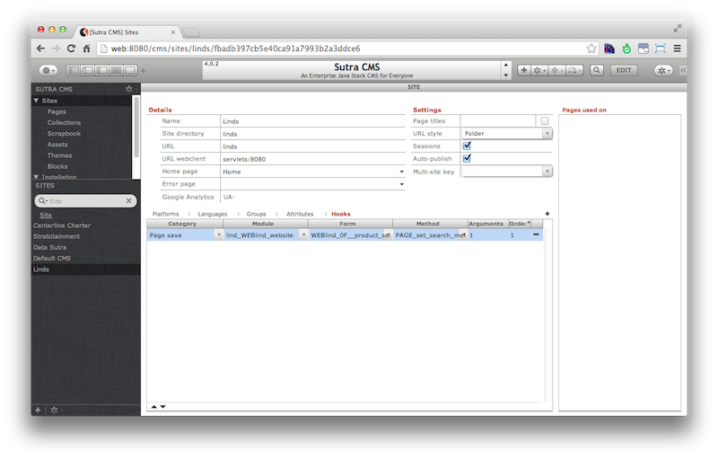

# Site Hooks

Site hooks is a mechanism by which you can associate site-wide events to
custom code.

*We are currently using this feature to cache pages and aggregate page
content into a single field to make searches speedy.*

<!-- toc -->

## API

### 1. Declare

Currently, hook strings are stored in value list:
`WEB_site_hook_category`. Hooks:

-   Page save
-   Page cancel

Obviously, this is currently hard coded into the CMS. Plans call for the
declaration process to be abstracted out as this feature gets expanded
out to additional hooks.

### 2. Register

On the site screen, go do the hooks tab and add a record. Choose the
hook and code to run for the hook.

Note that this allows you to run different code for a hook depending on
which site you are on.

### 3. Trigger

API call that you pass the hook string into to run the method that is
registered to the hook on the site record **.

    scopes.CMS.util.runHook('Page save')

