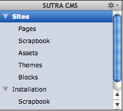
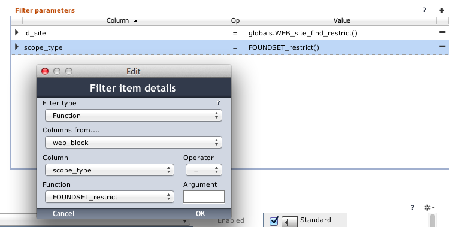
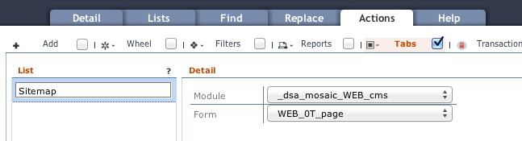
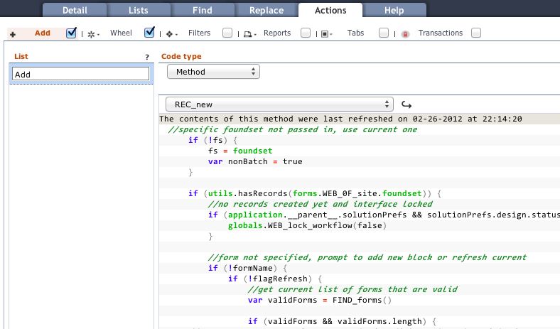

# Installation

Installation requires [Data Sutra](https://github.com/datamosaic/data-sutra).

> Installing Sutra CMS is exactly the same as installing [Data Sutra] except that you need to add an additional database connection called `sutra_cms`.

<!-- toc -->

## Installing the Sutra CMS modules

### Files

Download [installation files here](https://github.com/datamosaic/data-sutra/tree/master/data)

##### `README.txt`

Some basic instructions.

##### `sutra-cms_standalone.servoy`

Servoy install file with sample data. Includes the following modules:

-   `_dsa_mosaic_WEB_cms`
-   `_dsa_mosaic_WEB_cms_blocks`
-   `_dsa_mosaic_WEB_cms_connector`
-   `_dsa_mosaic_WEB_cms_resources`
-   `_ds_CODE_resources`

##### `sutra-cms.sql`

A MySQL dump file of all data. Included just in case. Not sure how well
it will work with PostgreSQL.

##### `sutraCMS` directory

Place this directory in Servoy’s server `ROOT` directory:

`/Servoy/application_server/server/webapps/ROOT/sutraCMS`

### Installation

###### 1. Create the following database connections

`sutra_cms`

###### 2. Install plugins

    - [The Browser Suite](https://www.servoyforge.net/projects/browsersuite) using the associated instructions
    - [keyListener.jar](https://www.servoyforge.net/projects/keylisteners) using the associated instructions

###### 3. Install files

Import the `sutra-cms_standalone.servoy` file

Place the `sutraCMS` directory in the `Servoy/application_server/server/webapps/ROOT` directory

###### 4. Include CMS modules

Include the `_dsa_mosaic_WEB_cms` module into the `__datasutra__connector` module. This will include all the CMS dependent modules will be as well.

### Server Settings

Open `http://localhost:8080/servoy-admin/plugin-settings` and set the
file plugin default path to “/”.

### Configuring Data Sutra

#### Forms

Go to the Data Sutra `Navigation engine` configuration pane, create a
new workspace, and setup the following navigation items:

-   Sites: `WEB_0F_site`
    -   Pages: `WEB_0F_page`
    -   Scrapbook: `WEB_0F_block__site` (site scoped scrapbook)
    -   Assets: `WEB_0F_asset`
    -   Themes: `WEB_0F_theme`
    -   Blocks: `WEB_0F_block`
-   Installation: `WEB_0F_install`
    -   Scrapbook: `WEB_0F_block__install` (install scoped scrapbook)

This will result in a workspace that looks like this:

#### Form filtering

Both of the scrapbook navigation items need filters applied.

1. Sites &gt; Scrapbook &gt; first filter

2. Sites &gt; Scrapbook &gt; second filter

3. Installation &gt; Scrapbook &gt; first filter

#### Universal Lists

Data Sutra allows you to easily create list forms without coding for
each navigation main form. Hence, you will not find list forms in the
Sutra CMS modules. You will need to create these yourself as needed.

In the `Navigation engine` configuration pane, select the `Lists` tab
and create a `universal list` for each navigation item. These are the
columns we recommend:

-   Sites: `site_name`
    -   Pages: `page_name`,
        `page_type | type: Valuelist | mask: WEB_page_type`,
        `rec_modified | type: Date | mask: MM-dd-yyyy or similar`
    -   Scrapbook: `block_name`
    -   Assets: `asset_name`,
        `asset_type | type: Valuelist | mask: WEB_asset_type`
    -   Themes: `theme_name`
    -   Blocks: `block_name`
-   Installation: (no list required)
    -   Scrapbook: `block_name`

#### Page tree view

To set up the tree view for the `Pages` navigation item

1.  go to the Data Sutra `Navigation engine` configuration pane
2.  select the `Actions` tab
3.  select the `Tabs` tab and turn on the checkbox
4.  create a `List` item called `Sitemap`
5.  assign from module `_dsa_mosiac_WEB_cms` form `WEB_0T_page`

#### Actions

For each of the main forms there are a number of methods that you need
to expose to your users. We prefix user triggered methods typically with
“REC\_”.

###### 1. `REC_new`

    1.  go to the Data Sutra `Navigation engine` configuration pane
    2.  select the `Actions` tab
    3.  select the `Add` tab and turn on the checkbox
    4.  create a `List` item called `Add`
    5.  assign `REC_new` of code type `Method`

Do this for all navigation items except `Pages` and `Installation`.

###### 2. `REC_delete`

    1.  go to the Data Sutra `Navigation engine` configuration pane
    2.  select the `Actions` tab
    3.  select the `Wheel` tab and turn on the checkbox
    4.  create a `List` item called `Delete`
    5.  assign `REC_delete` of code type `Method`

Do this for all navigation items except `Pages` and `Installation`.

###### 3. Additional `Wheel` methods

    1.  On the `Themes` page add `List` item called “Refresh theme” and
        assign method `REC_refresh`
    2.  On the `Blocks` page add `List` item called “Refresh block” and
        assign method `REC_refresh`

