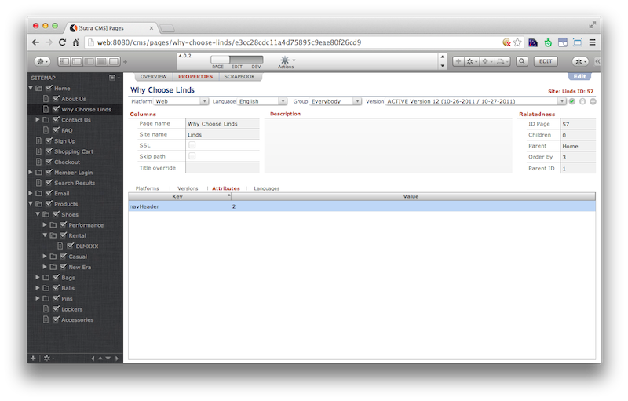

# Pages

<!-- toc -->

A website is a collection of pages. Organizing pages can be done a
number of ways.

## Site Map

Pages can be organized into groups of pages by moving pages under other
pages in the site map view pane.

To help facilitate page organization you can create “folder” pages.
These pages have no markup and will redirect incoming requests to the
first child page.

Page hierarchy is a fundamental driver for navigation and page listing
blocks. You can target all top level pages or a particular group of
pages—and include various levels of pages.

While you can create unlimited levels of page groups, after a certain
point managing the page levels may become more effort than the value
created by your organization structure.

Pages can have multiple children pages but only one parent page.

Key API methods:

    globals.CMS.markup.getHomePage(siteRec)
    globals.CMS.markup.getErrorPage(siteRec)
    globals.CMS.markup.getPagesDown(pageRec)
    globals.CMS.markup.getPagesUp(pageRec)


## Attributes

Pages can be explicitly “tagged” with attributes. Attributes come in the
form of key/value pairs. Attributes need to be set up for a site in the
`Site record` before they can be applied to pages.

Pages with common attribute keys allow you to group pages that are
located in disparate places in the site map. The attribute value can be
either left blank, used to order pages, or used to apply additional
structure.

Attributes allow you to code logic based on attribute key and value
present on a page. Use cases include navigation blocks, applying
specific markup, avoiding a page with a certain attribute, etc.

Pages can be tagged with multiple attributes.

Key API method:

    globals.CMS.markup.getPagesAttribute(data, att)




## Meta data

Pages have a LOT of additional meta data beyond their location in the
site map and the attributes applied to them which can be coded against.
Published status; active version; platform, language and group they
belong to; SEO headers; last updated; etc.

Sutra CMS collects all of this information for the current page request
and puts it in:

    globals.CMS.data

If you are iterating over a page collection we currently do not have a
method to return all page meta data in one shot. Instead, you need to
use Servoy’s relation objects to retrieve specific meta data for a page.
This requires a good understanding of Servoy’s foundset and relation
objects and how the Sutra CMS data structures are organized.


## Sample code

Bootstrap3 navigation block. Finds all pages with attribute “nav-main”,
sorts in site map order, and returns navigation markup:

```js
/**
 * @returns {String}	markup for this block
*/
function VIEW_main () {

	var markup = ''

	// get top pages
	/** @type {JSFoundset<db:/sutra_cms/web_page>}*/
	var pages = globals.CMS.markup.getPagesAttribute("nav-main")

	// open markup
	markup += '<div class="collapse navbar-collapse navbar-ex1-collapse" role="navigation">\n\
    <ul class="nav navbar-nav navbar-right">\n'

	if (typeof pages != 'number' && utils.hasRecords(pages)) {
		pages.sort("order_by asc")

		// level 1
		for (var i = 1; i <= pages.getSize(); i++) {
			var currentRec		= pages.getRecord(i)
			var page			= globals.CMS.token.getPage(currentRec)
			var templateLvlOne 	= '<li><a href="{{link}}" {{class}}>{{name}}</a></li>\n'
			var dataLvlOne		= { link : page.link, name : page.name, "class" : (currentRec.id_page == globals.CMS.data.page.id ? 'class="active"' : '' ) }
			markup 				+= globals.CMS.markup.merge(templateLvlOne,dataLvlOne)
		}
	}

	// close markup
	markup += '</ul>\n\
		</div>\n'

	return markup
}
```

